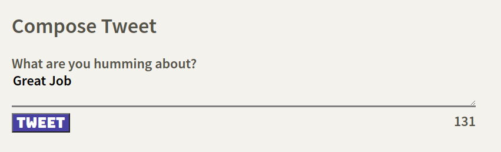
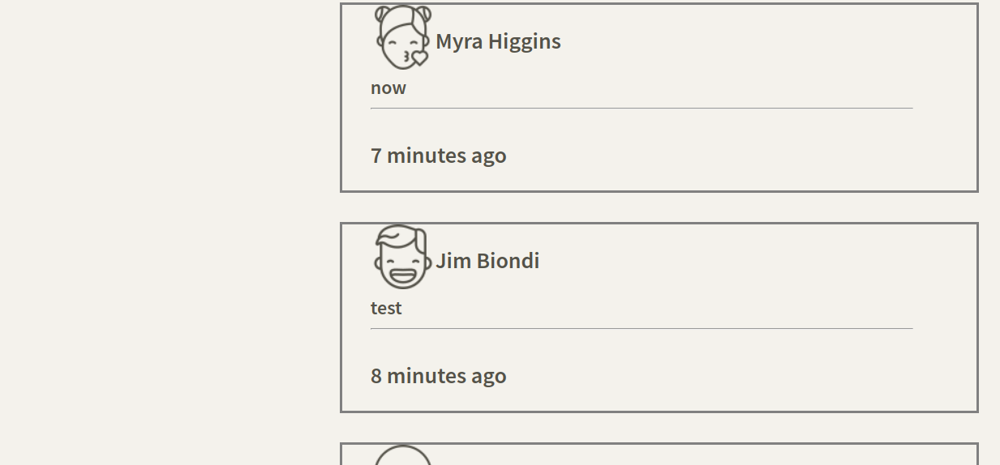
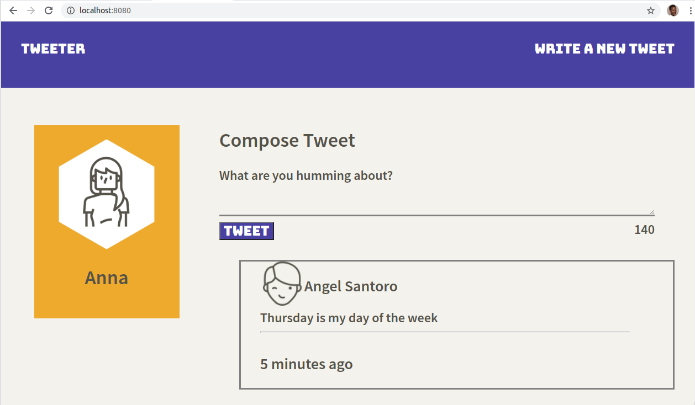
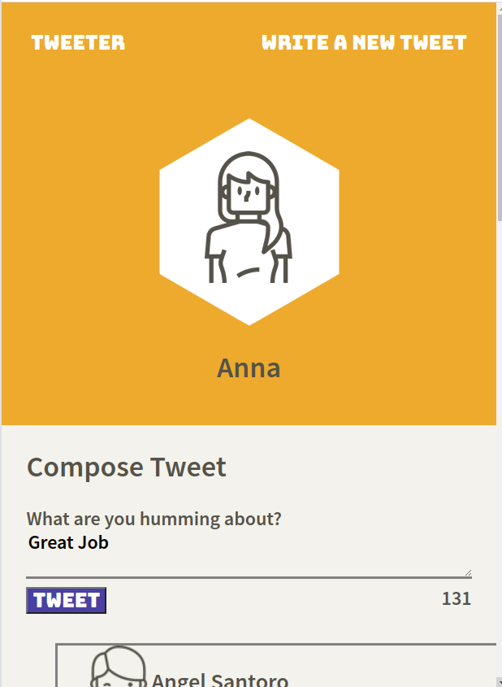

# Tweeter

 Tweeter is an apllication that allow user to share their tweets In this project HTML, CSS, JS, jQuery and AJAX front-end skills, and their Node, Express and MongoDB were used.

## Final Product

## Dependencies

- Node.js
- Express
- EJS
- bcrypt
- body-parser
- cookie-session

## Getting Started

- Install all dependencies (using the `npm install` command).

- Run the development web server using the `npm run local` command.
- Open the browser at `http://localhost:8080/` 
